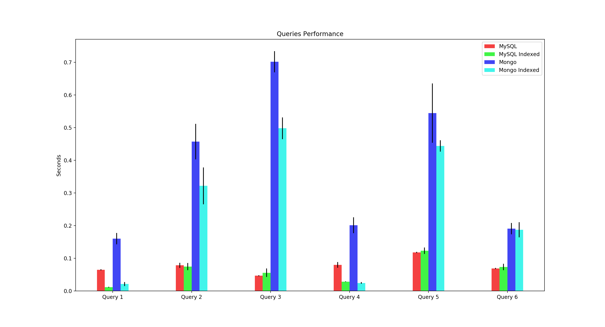

# taxi-rides-university-project

University project to compare and benchmark different database architecture and data modeling solutions.

## Dataset

[Chicago Taxi Rides 2016](https://www.kaggle.com/chicago/chicago-taxi-rides-2016) by [City of Chicago](https://www.kaggle.com/chicago)

## TODO

* Write report
* Add some spatial queries
* Test over the whole dataset
