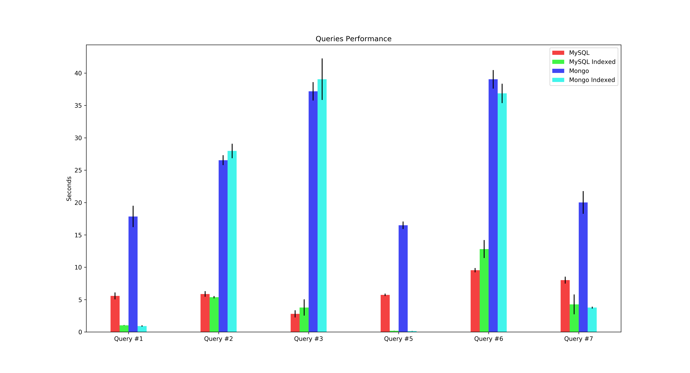

# taxi-rides-university-project

University project to compare and benchmark different database architecture and data modeling solutions.

Read the report [here (in italian)](Report.md)

## Dataset

[Chicago Taxi Rides 2016](https://www.kaggle.com/chicago/chicago-taxi-rides-2016) by [City of Chicago](https://www.kaggle.com/chicago)

## How to run

* Requirements: Docker, Docker Compose, Python3, Pip3
* Clone this repo
* Install python requirements `pip install -r requirements.txt`
* Start the services `docker compose up -d`
    * Access PHPMyAdmin at `localhost:8080`
    * Access MongoExpress at `localhost:8081`
* Place the dataset inside the `dataset` folder
* `make dataset` for the preprocessing
* `make import` for importing
* `make perf` for executing the queries with and without indexes
* `make graphs` for plotting the graphs
