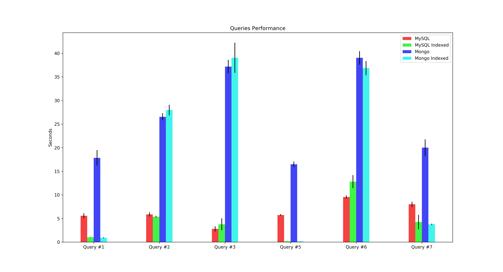
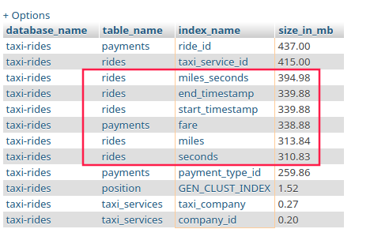
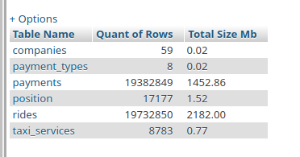

## Introduzione

Ho scelto di lavorare su un dataset rappresentante le corse di Taxi della città di Chicago nel 2016. Ho per prima cosa analizzato il dataset per capire come convenisse modellare, modellato la realtà sia in MySQL che MongoDB, svolto ed ottimizzato alcune query, confrontando le performance tra i due DBMS.

## Dataset

Il dataset utilizzato per il progetto è [Chicago Taxi Rides 2016](https://www.kaggle.com/chicago/chicago-taxi-rides-2016) caricato su Kaggle da [City of Chicago](https://www.kaggle.com/chicago). Il dataset è composto da 12 file `.csv` contententi i dati delle corse dei taxi per ogni mese del 2016. Il dataset include anche un file aggiuntivo (`column_remapping.json`) utilizzato per fare il mapping di alcuni valori del CSV ad altri valori (in particolare per i nomi delle compagnie dei taxi e le coordinate delle partenze e degli arrivi).

### Formato file CSV

I file CSV del dataset hanno le seguenti colonne:

* `taxi_id`, l'id del Taxi che ha svolto la corsa
* `trip_start_timestamp`, timestamp di inizio della corsa
* `trip_end_timestamp`, timestamp di fine della corsa
* `trip_seconds`, lunghezza della corsa in secondi
* `trip_miles`, distanza della corsa in miglia
* `fare`, importo della corsa
* `tips`, mancia aggiuntiva
* `tolls`, pedaggi 
* `extras`, extra, non specificate
* `trip_total`, totale, somma di `fare`, `tips`, `tolls`, `extras`
* `payment_type`, una stringa tra le seguenti: `Cash`, `Credit Card`, `Unknown`, `No Charge`, `Pcard`, `Prcard`, `Dispute`
* `company_id`, l'id della compagnia che ha preso in carico la corsa, il nome della compagnia è ottenibile tramite il file `column_remapping.json`
* `pickup_latitude`, id riconducibile ad una coordinata di latitudine di inizio corsa tramite il file `column_remapping.json`
* `pickup_longitude`, id riconducibile ad una coordinata di longitudine di inizio tramite il file `column_remapping.json`
* `dropoff_latitude`, id riconducibile ad una coordinata di latitudine di fine corsa tramite il file `column_remapping.json`
* `dropoff_longitude` id riconducibile ad una coordinata di longitudine di fine corsa tramite il file `column_remapping.json`
* `pickup_census_tract`, non usato, identificatore del [census tract](https://en.wikipedia.org/wiki/Census_tract) in cui è iniziata la corsa
* `dropoff_census_tract`, non usato, identificatore del [census tract](https://en.wikipedia.org/wiki/Census_tract) in cui è finita la corsa 
* `pickup_community_area`, non usato, identificatore del community area della città di Chicago in cui è iniziata la corsa
* `dropoff_community_area`, non usato, identificatore del community area della città di Chicago in cui è finita la corsa

### Analisi preliminare del dataset

La prima cosa che ho osservato nel dataset è l'assenza di molti valori all'interno di ciascuna riga. Gli unici dati che sono presenti in ogni riga sono i timestap di inizio e fine corsa (`trip_start_timestamp` e `trip_end_timestamp`), e uno tra l'id del taxi e della compagnia (volendo anche entrambe). Tutti gli altri campi possono sempre essere omessi. 

Un'altra cosa che ho notato da un'analisi preliminare è che la relazione tra `taxi_id` e `company_id` non è 1 a 1. Uno stesso taxi può aver svolto corse per più compagnie diverse.

Ulteriormente alcuni dei dati riguardanti i pagamenti sono logicamente errati (alcuni dei prezzi hanno valori come `12345` o `888.88`), probabilmente corse di prova da parte degli sviluppatori del sistema di tracking o (più probabilmente) delle prove da parte dei taxisti, ma questo non influisce la mia modellazione.

## Modellazione

### MySQL


Tabelle create:

* `companies`, usata per tenere traccia delle compagnie di taxi
    * `id`, *PRIMARY KEY*, lo stesso id ritrovato nel file CSV
    * `name`, *TEXT*, il nome della compagnia come recuperato dal file di mapping
* `rides`, usata per tenere traccia delle corse
    * `id`, *PRIMARY KEY*, autoincrementante
    * `taxi_service_id`, riferimento alla tabella `taxi_services`, indica la tupla (taxi, compagnia) che ha servito la corsa
    * `start_timestamp`, timestamp di inizio corsa
    * `end_timestamp`, timestamp di fine corsa
    * `seconds`, durata della corsa
    * `miles`, lunghezza della corsa
    * `start_location`, **POINT**, punto composto da (longitudine, latitudine) di inizio della corsa
    * `end_location`, **POINT**, punto composto da (longitudine, latitudine) di fine della corsa
* `taxi_services`, usata per rappresentare la tupla (taxi_id, company_id), visto che è quella che presta servizio 
    * `id`, *PRIMARY KEY*, autoincrementante
    * `taxi_id`, id del taxi, lo stesso che si ritrova nel file CSV
    * `company_id`, riferimento alla tabella `companies`
* `payment_types`, usata per tenere traccia dei vari metodi di pagamento
    * `id`, *PRIMARY KEY*, autoincrementante
    * `name`, *TEXT*, il testo associato al metodo di pagamento
*  `payments`
    *  `id` del pagamento, autoincrementante
    *  `ride_id`, riferimento alla tabella `ride`
    *  `fare`, `tips`, `tolls`, `extras`
    *  `total`, **COMPUTED COLUMN**, colonna che somma le colonne `fare`, `tips`, `tolls`, `extras`
    *  `payment_type_id`, riferimento alla tabella dei `payment_types`

#### Scelte attuate

* Per la tabella `rides` ho scelto di modellare `start_location` ed `end_location` come **POINTS**, dei particolari [Spatial Data Types](https://dev.mysql.com/doc/refman/5.7/en/spatial-types.html) disponibili da MySQL 5.7, in modo da facilitare le query geospaziali.
* Nella tabella `taxi_services` la colonna `taxi_id` non fa riferimento ad altre tabella, perchè non sono disponibili altre informazioni sui taxi. In caso fossero disponibili basterebbe creare una tabella `taxis` e collegarla tramite foreign key.
* Ho scelto di aggiungere la **COMPUTED COLUMN** `total` sulla tabella `payments` in modo da facilitare le eventuali query che richiedono di lavorare sul totale della corsa e non sui singoli campi del pagamento.

In allegato è possibile trovare il DDL usato per creare le tabelle.

### MongoDB

Per MongoDB ho scelto di usare la modellazione Embedded usando come oggetto più esterno quello che rappresenta la singola corsa.

```js
{
    "_id": ObjectID,
    "trip_start_timestamp": Date,
    "trip_end_timestamp": Date,
    "trip_seconds": Number,
    "trip_miles": Number,
    "taxi_service": {
        "taxi": {
            "id": Number
        },
        "company": {
            "id": Number,
            "name": String
        }
    },
    "payment": {
        "fare": Number,
        "tips": Number,
        "tolls": Number,
        "extras": Number,
        "payment_type": String
    },
    "pickup_location": {
        "type": "Point",
        "coordinates": [
            Number,
            Number
        ]
    },
    "dropoff_location": {
        "type": "Point",
        "coordinates": [
            Number,
            Number
        ]
    }
}
```

#### Scelte effettuate

Ho praticamente agito come per MySQL, ad eccezzione per non aver reso `payment_type` un oggetto a parte ma una semplice stringa (mentre per MySQL avevo creato una relazione separata per i vari *payment types*).

## Importazione

Sia per MySQL che per MongoDB ho creato degli script in Python per creare le tabelle/collezioni e per importare i dati.

Gli script in questione sono 

* `general/00-dataset.py` per il preprocessing del dataset
* `{mysql|mongo}/01-setup.py` per la creazione delle tabelle/collezioni 
* `{mysql|mongo}/02-import.py` per l'elaborazione delle righe e l'importazione 

### MySQL

Per velocizzare l'importazione in MySQL ho deciso di fare un pre-processing del dataset per estrarre, per prima cosa, le tabelle secondarie (ad esempio i dettagli delle compagnie, i metodi di pagamento) in modo da ottenere dei file più piccoli contenenti solo le informazioni univoche da importare nel database.
In questo modo evito di dover controllare (per ogni riga del dataset) se esistono già le tabelle correlate alla corsa (e quindi evito di fare più di una `SELECT` per ogni inserimento riga). 

Prima analizzo tutte le righe del file senza inserirle (che ha un costo temporale irrisorio rispetto all'esecuzione di svariate `SELECT` per ogni `ride`), produco un file per tutte le compagnie (`companies.csv`), uno per i metodi di pagamento (`payment_types.csv`) ed uno per la tupla `(taxi_id, company_id)` (`taxi_services.csv`), li importo nella rispettive tabelle mantenendo gli ID presenti nel file CSV, e solo in seguito importo le corse (tabella `rides`) le cui righe possono essere inserite direttamente, velocizzando notevolmente il processo di import.

Un altro espediente che ho usato per velocizzare l'importazione del dataset in MySQL è stato quella di usare il metodo `insert_many` al posto che `insert_one`, in questo modo al posto che inserire una riga alla volta ne inserisco 1000 per volta, anche questo velocizza notevolmente l'inserimento.

L'ultima tecnica che ho usato per velocizzare l'inserimento è stata quella di disabilitare al momento dell'import (per poi riattivarlo) l'autocommit (che eseguo solo una volta a fine di ogni file, una volta ogni 1.5Milioni di righe circa ), i controlli sulle foreign keys (che non mi servono in fase di import in quanto sono sicuro che i dati che importo siano consistenti) e sui valori unici (per lo stesso motivo).

### MongoDB

Anche qui ho preferito usare il metodo `insert_many` al posto che `insert` al fine di inserire 1000 documenti alla volta anzichè 1. Non è stato necessario fare altre particolari operazioni per velocizzare l'import dentro MongoDB.

### Tempi di importazione

| DBMS  | Righe Importate | Tempo di Import |
| ----- | --------------- | --------------- |
| MySQL | 10k             | 5.5s            |
| Mongo | 10k             | 2.4s            |
| MySQL | 100k            | 15s             |
| Mongo | 100k            | 10.9s           |
| MySQL | 1.7M            | 3m19s           |
| Mongo | 1.7M            | 3m1s            |

## Query

Ogni query è stata eseguita per 10 volte e per ogni esecuzione si è tenuto traccia del tempo. In seguito è stato calcolato il tempo medio e la deviazione standard. Ogni query è stata eseguita con e senza indici appositi.



### #1: Numero di corse più lunghe di 4 Miglia


**MySQL**

```sql
SELECT COUNT(*)
FROM rides
WHERE miles > 4
```

**MongoDB**

```js
db.rides.find({
    'trip_miles': { '$gt': 4 }
}).count()
```

Ottimizzata creando indice sul campo `miles`. 

* MySQL
    * Mean execution time: 5.57s
    * Max execution time: 7.048s
    * Min execution time: 5.039s
    * MySQL (Indexed)
        * Mean execution time: 1.036s
        * Max execution time: 1.115s
        * Min execution time: 1.002s
    * Speedup with indexes: 5.38x
* Mongo
    * Mean execution time: 17.846s
    * Max execution time: 22.364s
    * Min execution time: 16.576s
    * Mongo (Indexed)
        * Mean execution time: 0.925s
        * Max execution time: 1.219s
        * Min execution time: 0.84s
    * Speedup with indexes: 19.29x
* MySQL vs Mongo
    * MySQL is 3.2 times faster than MongoDB
    * MySQL (Indexed) is 0.89 times faster than MongoDB (Indexed)

### #2: Prezzo medio delle corse

**MySQL**

```sql
SELECT avg(fare) as avg_fare
FROM payments
```

**MongoDB**

```js
db.rides.aggregate([
    {
        '$group': { 
            '_id': None, 
            'fare': { '$avg': "$payment.fare" } 
        }
    }
])
```

Solo su MySQL aggiungendo un indice sulla colonna `payments.fare` si ottiene un miglioramento (seppur minimale) delle performance. E' osservabile infatti che aggiungendo l'indice, nonostante non si tratti di un'operazione di ricerca, questo indice viene usato nell'operazione di `AVG()` come mostrato dall'EXPLAIN della query:


* MySQL
    * Mean execution time: 5.869s
    * Max execution time: 6.512s
    * Min execution time: 5.14s
    * MySQL (Indexed)
        * Mean execution time: 5.374s
        * Max execution time: 5.801s
        * Min execution time: 5.155s
    * Speedup with indexes: 1.09x
* Mongo
    * Mean execution time: 26.546s
    * Max execution time: 28.101s
    * Min execution time: 25.535s
    * Mongo (Indexed)
        * Mean execution time: 27.977s
        * Max execution time: 29.575s
        * Min execution time: 26.459s
    * Speedup with indexes: 0.95x
* MySQL vs Mongo
    * MySQL is 4.52 times faster than MongoDB
    * MySQL (Indexed) is 5.21 times faster than MongoDB (Indexed)


### #3: Le prime 10 compagnie che hanno fatto più viaggi

**MySQL**

```sql
SELECT companies.name, COUNT(*) as n_trips 
FROM rides JOIN taxi_services ON rides.taxi_service_id = taxi_services.id 
    JOIN companies ON taxi_services.company_id = companies.id
GROUP BY companies.id
ORDER BY n_trips DESC
LIMIT 10
```

**MongoDB**

```js
db.rides.aggregate([
    {
        '$group': { 
            '_id': '$taxi_service.company.id',
            'company_name': { '$first': '$taxi_service.company.name' },
            'rides': { '$sum': 1 }
        }
    },
    {
        '$sort': { 'rides': -1 }
    },
    {
        '$limit': 10
    }
])
```

* MySQL
    * Mean execution time: 2.807s
    * Max execution time: 4.421s
    * Min execution time: 2.504s
    * MySQL (Indexed)
        * Mean execution time: 3.786s
        * Max execution time: 7.486s
        * Min execution time: 3.096s
    * Speedup with indexes: 0.74x
* Mongo
    * Mean execution time: 37.189s
    * Max execution time: 39.741s
    * Min execution time: 35.448s
    * Mongo (Indexed)
        * Mean execution time: 39.059s
        * Max execution time: 44.927s
        * Min execution time: 34.439s
    * Speedup with indexes: 0.95x
* MySQL vs Mongo
    * MySQL is 13.25 times faster than MongoDB
    * MySQL (Indexed) is 10.32 times faster than MongoDB (Indexed)


### #5: Numero di corse tra il 1° e il 12° Gennaio 2016

**MySQL**

```sql
SELECT count(*) FROM rides 
WHERE start_timestamp >= '2016-01-01 00:00:00'
AND start_timestamp < '2016-01-12 00:00:00'
```

**MongoDB**

```js
db.rides.find([
    {
        'trip_start_timestamp': {
            '$gte': new Date("2016-01-01 00:00:00"),
            '$lt': new Date("2016-01-12 00:00:00")
        }
    }
]).count()
```

Ottimizzata aggiungendo un indice su `start_timestamp`


* MySQL
    * Mean execution time: 5.739s
    * Max execution time: 6.025s
    * Min execution time: 5.474s
    * MySQL (Indexed)
        * Mean execution time: 0.192s
        * Max execution time: 0.221s
        * Min execution time: 0.182s
    * Speedup with indexes: 29.83x
* Mongo
    * Mean execution time: 16.489s
    * Max execution time: 17.644s
    * Min execution time: 15.578s
    * Mongo (Indexed)
        * Mean execution time: 0.137s
        * Max execution time: 0.185s
        * Min execution time: 0.131s
    * Speedup with indexes: 120.07x
* MySQL vs Mongo
    * MySQL is 2.87 times faster than MongoDB
    * MySQL (Indexed) is 0.71 times faster than MongoDB (Indexed)


### #6: Numero di viaggi più lunghi di 1 ora (lunghezza calcolata come time difference)

**MySQL**

```sql
SELECT count(*) FROM rides 
WHERE time_to_sec(TIMEDIFF(end_timestamp, start_timestamp)) / 3600 > 1
```

**MongoDB**

```js
db.rides.aggregate([
    {
        '$project': {
            'hours': {
                '$divide': [
                        {
                            '$subtract': ['$trip_end_timestamp', '$trip_start_timestamp']
                        }, 
                        1000*60*60
                ]
            }
        }
    },
    {
        '$match': {
            'hours': {
                '$gt': 1
            }
        }                    
    },
    {
        '$count': 'trips_longer_than_1_hour'
    }
])
```

Come previsto, aggiungere un idice sia `start_timestamp` che su `end_timestamp` le performance non migliorano.

* MySQL
    * Mean execution time: 9.544s
    * Max execution time: 10.186s
    * Min execution time: 9.111s
    * MySQL (Indexed)
        * Mean execution time: 12.814s
        * Max execution time: 15.666s
        * Min execution time: 11.024s
    * Speedup with indexes: 0.74x
* Mongo
    * Mean execution time: 39.04s
    * Max execution time: 41.224s
    * Min execution time: 37.034s
    * Mongo (Indexed)
        * Mean execution time: 36.864s
        * Max execution time: 39.278s
        * Min execution time: 34.675s
    * Speedup with indexes: 1.06x
* MySQL vs Mongo
    * MySQL is 4.09 times faster than MongoDB
    * MySQL (Indexed) is 2.88 times faster than MongoDB (Indexed)


### #7: Numero di viaggi più lunghi di 10 minuti e più brevi di 2 miglia

**MySQL**

```sql
SELECT count(*) FROM rides 
WHERE seconds > 10*60 AND miles > 2
```

**MongoDB**

```js
db.rides.find({
    'trip_seconds': {
        '$gt': 10*60
    },
    'trip_miles': {
        '$gt': 2
    }
}).count()
```

Aggiungere un indice su `miles` e uno su `seconds` non aiuta le performance. E' necessario aggiungere un indice composto su `(miles, seconds)` per ottenre un guadagno di performance.

Come si vede nel query plan di MySQL (ma una situazione analoga vale anche per MongoDB), gli indici singoli non vengono considerati per questa `WHERE` a doppia condizione:


Con l'indice composto:


* MySQL
    * Mean execution time: 8.005s
    * Max execution time: 9.352s
    * Min execution time: 7.202s
    * MySQL (Indexed)
        * Mean execution time: 4.26s
        * Max execution time: 5.681s
        * Min execution time: 1.864s
    * Speedup with indexes: 1.88x
* Mongo
    * Mean execution time: 20.011s
    * Max execution time: 23.232s
    * Min execution time: 18.09s
    * Mongo (Indexed)
        * Mean execution time: 3.77s
        * Max execution time: 4.174s
        * Min execution time: 3.599s
    * Speedup with indexes: 5.31x
* MySQL vs Mongo
    * MySQL is 2.5 times faster than MongoDB
    * MySQL (Indexed) is 0.88 times faster than MongoDB (Indexed)


## Dimensioni Indici

Per MySQL è possibile ottenere la dimensione degli indici con [questa query](https://stackoverflow.com/a/36573801/2083717):

```sql
SELECT database_name, table_name, index_name, 
        round(stat_value*@@innodb_page_size/1024/1024, 2) as size_in_mb
FROM mysql.innodb_index_stats
WHERE stat_name = 'size' 
    AND index_name != 'PRIMARY'
ORDER BY size_in_mb DESC
```



Per MongoDB invece è possibile usare il comando `db.rides.stats()`:

## Dimensione Tabelle

[MySQL](https://stackoverflow.com/questions/9620198/how-to-get-the-sizes-of-the-tables-of-a-mysql-database)

```sql
SELECT TABLE_NAME AS "Table Name", 
        table_rows AS "Quant of Rows", 
        ROUND( ( data_length + index_length ) /1024/1024, 2 ) AS "Total Size Mb" 
FROM information_schema.TABLES 
WHERE information_schema.TABLES.table_schema = 'taxi-rides' 
LIMIT 0 , 30
```




Per MongoDB invece è possibile usare il comando `db.rides.stats()`:
